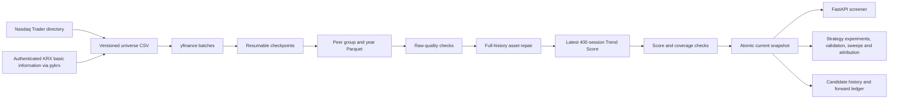
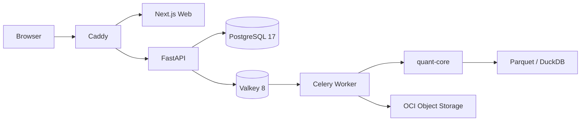

# Quant Trend Lab Architecture

## Runtime Modes

`APP_MODE` is fixed at process start and cannot be changed through the API.

| Mode | Data | Intended environment | Public exposure |
| --- | --- | --- | --- |
| `public_demo` | Deterministic fictional market | Local, CI, public OCI | Allowed |
| `local_research` | Nasdaq/KRX current universe and yfinance end-of-day prices | Developer machine only | Not allowed |

The public container image defaults to `public_demo`. Real price data, downloaded universe files, and real-data results are ignored by Git and must not be copied to Object Storage prefixes used by the public application.

## Local Research Pipeline

- Startup and scheduled syncs use exchange calendars to determine each market's latest completed session.
- Initial collection requests ten years; incremental collection overlaps 45 calendar days and only replaces matching asset/date rows.
- A newly observed dividend, split, or invalid price triggers a full-history refresh for that asset before activation. Provider repairs remain visible through `provider_repaired` instead of silently replacing provenance.
- Remaining asset-level errors become `INVALID_DATA` and are excluded from scoring. Dataset structure, reference-data, score-invariant, quarantine-limit, and severe coverage failures block activation, so the previous pointer remains current.
- Every activated snapshot contains `quality/summary.json` and `quality/issues.parquet`. Failed-run reports are retained separately under `quality-runs/<sync-id>` for the latest ten runs.
- Direct local execution uses SQLite for universe-snapshot and sync-run metadata, while Compose and OCI use PostgreSQL 17. Raw bars and score time series stay in local Parquet snapshots.
- Snapshot activation is an atomic pointer replacement. Interrupted runs are marked failed at startup and their completed download checkpoints are reusable.
- Strategy experiments pin their input snapshot with a lease, cache fixed annual Trend Feature partitions, project strategy-specific scores, and emit full, independent-validation, walk-forward, stress, daily, review, and trade-episode results. Sweep work is serialized with single-run work in the same Celery queue.
- Forward processing runs after successful activation in a separate failure boundary. Its failure cannot roll back the market-data pointer, and retrying one data version cannot duplicate reviews, orders, trades, or valuations.
- Toss Securities Open API is a dormant local-only adapter. A manual admin check verifies OAuth and representative KR/US stock metadata, but no startup, sync, scoring, replay, or forward path calls it.

## Components

- `quant-core` owns scoring, deterministic explanations, synthetic data, portfolio rules, and backtesting. It does not import FastAPI or SQLAlchemy.
- FastAPI owns public contracts, request validation, rate limiting, job metadata, and artifact links.
- PostgreSQL stores metadata and compact result summaries. Full result, trade, and time-series files are stored as JSON, CSV, HTML, and Parquet artifacts.
- Candidate snapshots keep score source rows in local Parquet and compact `BASELINE/ENTERED/RETAINED/EXITED` events in SQL. Forward cash, positions, reviews, orders, trades, and valuations use separate append-oriented ledger tables with one baseline and three experimental active slots.
- Next.js renders the Korean operational interface. The Pydantic OpenAPI document generates its TypeScript contract.

## Database Test Matrix

| Command | Database | Purpose |
| --- | --- | --- |
| `make test` | Temporary SQLite file | Fast unit, property, and API contract tests |
| `make test-integration` | Disposable PostgreSQL 17 and Valkey 8 containers | Alembic/schema checks, repository transactions, Redis rate limits, and Celery broker/backend round-trips |
| `docker compose up` | Persistent PostgreSQL 17 volume | Local full-stack behavior |
| OCI deployment | Persistent PostgreSQL 17 volume | Production metadata and job state |

The integration Compose file publishes PostgreSQL and Valkey on Docker-assigned loopback ports and tears down their tmpfs-backed data after every run. PostgreSQL accepts only a local database whose name ends in `_test`. Valkey rejects URL overrides and requires a guard derived from the disposable container ID before any database cleanup, preventing destructive integration tests from targeting persistent services.

## Reproducibility Contract

Every result records:

- `demo-market-v1.0.0`
- `trend-score-v1.0.0`
- `portfolio-v1.0.0`
- `data-quality-v1.0.0`
- `price-pipeline-v2.0.0`
- `real-replay-v1.1.0`
- `market-event-v1.1.0`
- `replay-analysis-v1.0.0`
- `replay-strategy-v2.0.0`
- `trend-score-v2.0.0` strategy projection
- `portfolio-v2.0.0`
- `real-replay-v2.0.0`
- `market-event-v2.0.0`
- `replay-analysis-v2.0.0`
- `replay-feature-cache-v2.0.0`
- score configuration hash
- portfolio configuration hash
- date range and transaction-cost assumptions

The synthetic generator uses seed `20260710` and fixed dates from 2016-01-04 through 2026-06-30.

## Security Boundaries

- Caddy is the only container publishing ports, and only 80/443 are public in production.
- PostgreSQL and Valkey remain on an internal Docker network.
- Runtime Object Storage access uses the VM instance principal. No OCI API private key is stored in application environment variables.
- Public backtests accept only four integer basis-point weights summing to 10,000. They cannot execute custom code or select arbitrary data.
- Raw client IPs are never persisted. A keyed HMAC is retained in Valkey for at most one hour for rate and concurrency controls.
- Artifact downloads use object-specific, ten-minute OCI pre-authenticated requests.
- KRX and Toss credentials remain secret settings. Toss access tokens are memory-only, and provider diagnostics persist no credentials, token, or raw response.
