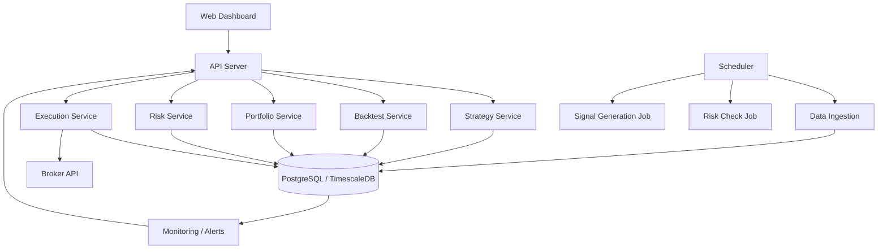

# Quant Trading Product Design

## Confirmed Product Direction

- Combine a personal quant research tool with a beginner-friendly signal dashboard.
- Support US stocks, Korean stocks, US ETFs, and Korean ETFs as separate comparison groups.
- Start with paper trading only. Personal live automation is a later phase.
- Make the first core feature an explainable trend-following screener, not a buy/sell recommendation engine.
- Show a trend score with concrete reasons and warnings.

The adopted scoring specification is [Trend Score v1](./trend-score-v1.md).

## 1. Product Goal

Build a local-first product for systematic investing that combines personal quant research with a dashboard a beginner can understand. The first strategy surface is a trend-following screener that finds candidates across US and Korean stocks and equity ETFs, then explains why each candidate passed, was downgraded, or was excluded.

The first version focuses on reproducible scoring, trustworthy validation, paper trading, and risk controls. It must not place live orders. Personal live automation can be added only after signal generation, execution assumptions, and monitoring have been proven reliable.

## 2. Target User

Primary user:

- Beginner individual investor interested in quant investing
- Wants plain-language explanations before learning detailed indicators
- Wants repeatable rules instead of discretionary stock selection
- Needs to distinguish a candidate screen from a buy recommendation

Secondary future users:

- Small investment group
- Financial content creator
- Internal research team

## 3. Core Principles

### Reproducibility

Every backtest and signal generation run must be tied to:

- Strategy version
- Data snapshot
- Universe definition
- Parameter set
- Transaction cost assumptions
- Execution assumptions

### Separation of Concerns

Research, portfolio construction, execution, and monitoring should be separate modules. This prevents research code from directly placing orders and makes failures easier to isolate.

### Auditability

Every signal, decision, order, fill, position change, and portfolio metric should be stored. A trading product without audit logs becomes hard to trust.

### Risk First

Before optimizing returns, the system should enforce:

- Max position size
- Max sector or factor concentration
- Max daily turnover
- Max daily loss
- Max drawdown threshold
- Kill switch
- Manual approval option

## 4. MVP Scope

### Included

- Daily OHLCV and corporate-action-aware data ingestion
- US stocks, KOSPI stocks, KOSDAQ stocks, US equity ETFs, and Korean equity ETFs
- Versioned Trend Score v1 calculation
- Trend candidate list with deterministic reasons, warnings, and exclusion codes
- Separate screener validation and portfolio backtesting
- Parameterized, predefined strategy rules
- Paper trading portfolio and proposed trades
- Portfolio, performance, and risk reports
- Dashboard for candidates, scores, positions, and paper performance
- Basic alerting for failed jobs or risk threshold breaches

### Excluded From MVP

- High-frequency or intraday trading
- Options, futures, crypto, forex
- Fully automated live trading
- Manual live order placement
- Social/community features
- AI-generated buy/sell recommendations
- Free-form AI explanations for score results
- Custom Python strategy execution in the first increment

## 5. Core User Flow

1. Select a market and product comparison group.
2. Set the paper account size and default planned order amount.
3. Review trend candidates, component scores, reasons, and warnings.
4. Open an asset detail view to inspect price history and exclusion conditions.
5. Add selected candidates to a watchlist or paper strategy.
6. Validate the screener and the paper portfolio separately on historical data.
7. Generate raw scores daily and update the official candidate list weekly.
8. Review proposed paper trades and risk checks.
9. Track paper portfolio performance, turnover, drawdown, and candidate changes.
10. Add brokerage connectivity only in a later phase.

## 6. Product Modules

### Data Module

Responsibilities:

- Ingest market data
- Adjust prices for splits and dividends
- Store historical data
- Validate missing or abnormal values
- Version data snapshots used in backtests

Data types:

- Daily OHLCV
- Corporate actions
- Fundamentals
- Index and benchmark data
- Sector and industry classifications
- Risk-free rate

### Strategy Research Module

Responsibilities:

- Define signal logic
- Manage strategy parameters
- Run historical experiments
- Compare strategy versions

Initial strategy families:

- Momentum
- Moving average trend following
- Relative-strength ranking
- 52-week-high trend quality

Future strategy families:

- Value factor
- Quality factor
- Low volatility
- Mean reversion
- Multi-factor ranking

### Backtest Module

Responsibilities:

- Simulate rebalancing
- Apply transaction costs and slippage
- Calculate returns, drawdowns, turnover, hit rate, and exposure
- Persist full trade and portfolio history

Minimum required metrics:

- CAGR
- Volatility
- Sharpe ratio
- Sortino ratio
- Max drawdown
- Calmar ratio
- Win rate
- Average gain/loss
- Turnover
- Number of trades
- Exposure over time

### Portfolio Construction Module

Responsibilities:

- Convert signals into target weights
- Enforce constraints
- Rebalance portfolio
- Generate proposed trades

Examples:

- Equal weight top N
- Score-weighted portfolio
- Volatility-adjusted weights
- Sector-neutral allocation
- Max single-position cap

### Risk Module

Responsibilities:

- Validate target portfolio before orders are created
- Detect drawdown, concentration, and exposure violations
- Block unsafe order sets
- Trigger alerts

Risk checks:

- Position limit
- Cash limit
- Leverage limit
- Turnover limit
- Loss limit
- Missing data guard
- Stale signal guard

### Execution Module

Responsibilities:

- Turn proposed trades into broker-compatible orders
- Support paper execution first
- Later support live broker integration
- Store orders, fills, rejections, and errors

Execution modes:

- Backtest simulation
- Paper trading
- Manual live trading
- Automated live trading, future only

### Monitoring Module

Responsibilities:

- Show job health
- Show strategy health
- Show portfolio drift
- Show current risk status
- Alert on failed data ingestion, failed signals, or blocked trades

## 7. System Architecture

## 8. Adopted Technical Stack

### Backend

- Python 3.12
- FastAPI, Pydantic 2, SQLAlchemy 2, Alembic
- Celery with Valkey 8 for background jobs

### Data

- PostgreSQL 17 for metadata, compact summaries, and paper ledgers
- Valkey 8 for job queues, cache, and rate limiting
- Parquet and DuckDB for full time series
- OCI Object Storage for versioned data and run artifacts

### Quant Libraries

- Polars Lazy/DataFrame APIs
- NumPy, PyArrow, and DuckDB
- A deterministic custom daily backtest engine for the fixed reference strategy

### Frontend

- Next.js 16 App Router, React 19, and strict TypeScript
- Tailwind CSS 4, Radix UI, shadcn-style primitives, and Lucide icons
- Apache ECharts

### Infrastructure

- Docker Compose and Caddy on the existing OCI ARM64 Compute VM
- Private OCIR multi-architecture images and GitHub Actions CI/CD
- OCI Resource Manager, Instance Principal, Vault, Monitoring, Block Volume, and Object Storage

## 9. Initial Domain Model

Core entities:

- User
- Market
- Asset
- PriceBar
- CorporateAction
- Strategy
- StrategyVersion
- BacktestRun
- BacktestMetric
- Signal
- Portfolio
- Position
- ProposedTrade
- Order
- Fill
- RiskCheck
- JobRun
- Alert

## 10. MVP Screens

### Trend Screener

- Separate tabs for US ETFs, US stocks, Korean ETFs, KOSPI, and KOSDAQ
- Candidate state, Trend Score, comparison-group rank, and as-of time
- Up to three deterministic selection reasons
- Up to two warnings
- Explicit exclusion reasons
- Filters for score, state, volatility warning, and liquidity eligibility
- Action to add an asset to a watchlist or paper strategy

### Asset Detail

- Price chart with 50-day and 200-day moving averages
- Six Trend Score components
- Historical score and candidate-state changes
- Market and product warnings
- Candidate entry, maintenance, and removal conditions

### Dashboard

- Portfolio value
- Daily return
- Drawdown
- Active strategies
- Latest signals
- Risk status
- Failed jobs

### Strategy List

- Strategy name
- Version
- Status
- Last backtest
- Paper trading status
- Key metrics

### Backtest Detail

- Equity curve
- Drawdown chart
- Monthly returns
- Trades table
- Holdings over time
- Metrics summary
- Parameter set

### Signal Review

- Latest selected assets
- Scores and ranks
- Current holdings
- Proposed trades
- Risk check result
- Approve/reject action for future live trading

### Portfolio

- Holdings
- Cash
- Exposure
- Sector allocation
- Drift from target
- Performance attribution

## 11. Roadmap

### Phase 1: Research MVP

- Local data ingestion
- Strategy framework
- Backtesting
- Backtest reports
- Basic web dashboard

### Phase 2: Paper Trading

- Daily scheduled signal generation
- Paper portfolio
- Proposed trades
- Monitoring and alerts
- Risk checks

### Phase 3: Broker Integration

- Brokerage account connection
- Position sync
- Manual order approval
- Live order placement
- Order/fill reconciliation

### Phase 4: Advanced Quant Features

- Multi-factor modeling
- Walk-forward testing
- Monte Carlo simulation
- Factor exposure analysis
- Portfolio optimization
- Regime filters

## 12. First Strategy Candidate

### Explainable Trend Screener

The first implemented strategy surface is Trend Score v1.

Universe:

- Eligible US and Korean common stocks
- Eligible US and Korean long-only equity ETFs
- Separate rankings for each comparison group

Candidate gate:

- Sufficient history and valid data
- Price above the 200-day moving average
- Positive six-month return
- Market-specific liquidity and planned-order-size checks

Score:

- Long-term trend: 30
- Absolute momentum: 25
- Relative strength: 20
- 52-week-high proximity: 10
- Volatility stability: 10
- Trading activity: 5

The screener is not yet a complete portfolio strategy. Holding count, sizing, exit, rebalance, and cash rules remain separate design decisions.

## 13. Resolved MVP Decisions

- Use a KRW 50,000,000 unified paper account with four default 25% sleeves and at most 12 holdings.
- Apply the entry, exit, capacity, weak-market, currency, and cost rules in `portfolio-v1.0.0`.
- Keep the public deployment synthetic-only and permit yfinance only in local personal research mode.
- Use versioned current-universe CSV inputs for initial real-data validation and display survivorship-bias warnings.
- Keep live broker integration, strategy authoring, and licensed point-in-time data outside MVP.

## 14. Implementation Baseline

The repository implements the synthetic public vertical slice, local real-data adapter boundary, Trend Score engine, reference portfolio backtest, FastAPI contracts, Korean dashboard, automated tests, multi-architecture containers, and OCI infrastructure configuration. Broker connectivity and point-in-time licensed validation remain later release gates.
